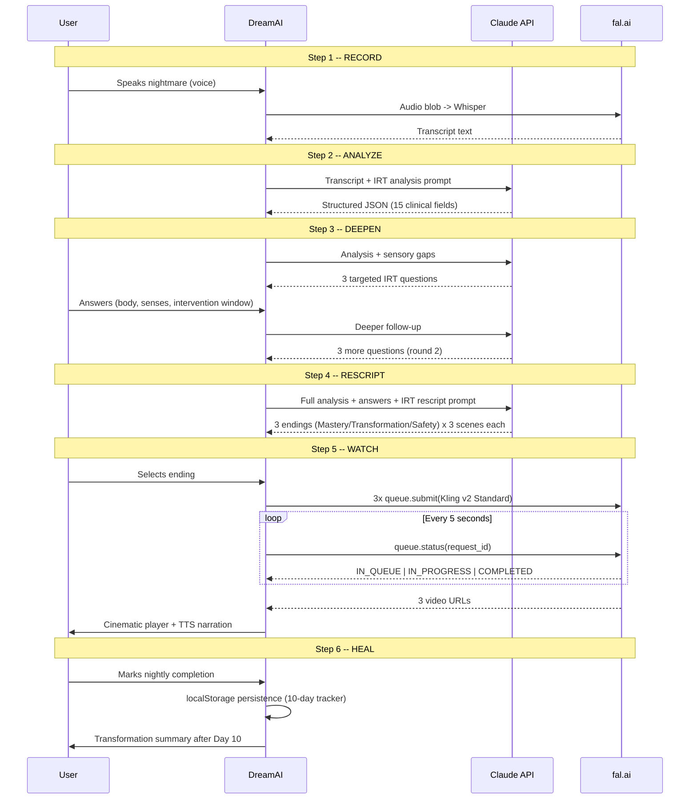

# DreamAI -- Architecture & Build Document

> AI-powered Image Rehearsal Therapy platform for nightmare treatment.
> Built for the partnership with Dr. Michael Breus, PhD -- The Sleep Doctor.

---

## The Clinical Foundation

**Image Rehearsal Therapy (IRT)** is the gold standard for nightmare treatment:
- 70% nightmare reduction (Krakow & Zadra, 2006)
- 90% maintain gains at 6 months (Aurora et al., 2010)
- AASM Level A recommendation for PTSD nightmares

**The problem**: IRT requires a trained therapist, multiple sessions, and the patient must *imagine* the rescripted ending. There's no visual rehearsal tool. DreamAI changes this by generating personalized cinematic video of the new dream ending.

---

## System Architecture

```mermaid
graph TB
    subgraph Client ["Browser (Next.js Client)"]
        A[VoiceRecorder] --> B[DreamDiary]
        B --> C[FollowUpChat]
        C --> D[RescriptingView]
        D --> E[VideoGenerator]
        E --> F[DreamPlayer]
        F --> G[HabitTracker]
        G --> H[TransformationView]
    end

    subgraph APIs ["Next.js API Routes (Vercel Serverless)"]
        A1["/api/transcribe"]
        A2["/api/analyze"]
        A3["/api/followup"]
        A4["/api/rescript"]
        A5["/api/generate-scenes"]
        A6["/api/scene-status"]
    end

    subgraph External ["External AI Services"]
        W["fal.ai Whisper<br/>(Speech-to-Text)"]
        CL["Claude API<br/>(Sonnet 4 + Haiku 4.5)"]
        KL["fal.ai Kling v2<br/>(Text-to-Video)"]
    end

    A -->|audio blob| A1
    A1 -->|FormData| W
    B -->|transcript| A2
    A2 -->|IRT analysis prompt| CL
    C -->|analysis + answers| A3
    A3 -->|follow-up prompt| CL
    D -->|analysis + answers| A4
    A4 -->|rescript prompt| CL
    D -->|selected scenes| A5
    A5 -->|queue.submit()| KL
    E -->|poll request_id| A6
    A6 -->|queue.status()| KL

    style Client fill:#0F1320,stroke:#D4A574,color:#EDE9E3
    style APIs fill:#161B2E,stroke:#D4A574,color:#EDE9E3
    style External fill:#1a1a2e,stroke:#8B9CC7,color:#EDE9E3
```

---

## 6-Step Protocol Flow



---

## AI Models & Prompts

### Claude API (Analysis + Rescript)
| Endpoint | Model | Fallback | Max Tokens | Purpose |
|----------|-------|----------|------------|---------|
| `/api/analyze` | Sonnet 4 | Haiku 4.5 | 2,500 | Clinical nightmare analysis (15 fields) |
| `/api/followup` | Sonnet 4 | Haiku 4.5 | 1,000 | IRT-targeted sensory questions |
| `/api/rescript` | Sonnet 4 | Haiku 4.5 | 2,500 | 3 alternative endings x 3 scenes |

**Retry strategy**: 2 attempts per model, Sonnet -> Haiku fallback. Strips markdown code blocks from response.

### Analysis Output (15 Clinical Fields)
```
setting, characters, narrative, sensory_details (5 channels),
emotions (with intensity 0-10), somatic_response,
nightmare_classification (9 types), core_threat,
dream_distortions, themes, nightmare_intensity (NDQ framework),
recurrence_indicators, waking_life_links,
turning_point, intervention_window
```

### fal.ai (Video + Transcription)
| Service | Model | Cost | Duration |
|---------|-------|------|----------|
| Transcription | `fal-ai/whisper` | ~$0.01 | 2-5s |
| Video generation | `fal-ai/kling-video/v2/standard/text-to-video` | ~$0.15-$0.30/clip | 60-180s |

**Video prompt engineering**: First-person POV enforced via:
- Positive: "Shot from inside the dreamer's eyes, hands visible in frame"
- Negative: "third person view, external person, over the shoulder, back of head"
- Style: "Emmanuel Lubezki cinematography, anamorphic lens"
- Mood-based camera movements and lighting per scene

---

## Cost Structure Per Session

| Component | Cost |
|-----------|------|
| Whisper transcription | $0.01 |
| Claude analysis (Sonnet 4) | $0.02-$0.05 |
| Claude follow-up x2 rounds | $0.02-$0.04 |
| Claude rescript (3 endings) | $0.03-$0.06 |
| Kling v2 Standard x3 scenes | $0.45-$0.90 |
| **Total per session** | **$0.53-$1.06** |

At $5 fal.ai credit: ~5-8 full sessions.

---

## Tech Stack

```
Framework:      Next.js 16.2.3 (App Router, Turbopack)
Language:       TypeScript
Styling:        Tailwind CSS v4
Fonts:          Playfair Display (headings) + DM Sans (body)
AI - Text:      Anthropic Claude API (Sonnet 4 / Haiku 4.5)
AI - Video:     fal.ai Kling v2 Standard (text-to-video)
AI - Speech:    fal.ai Whisper (transcription)
TTS:            Browser SpeechSynthesis API
Persistence:    localStorage (habit tracker)
Hosting:        Vercel (serverless functions)
```

---

## Key Technical Decisions

### Why Queue-Based Video Generation?
Kling v2 takes 1-3 minutes per scene. Vercel serverless functions timeout at 10-60s. Solution:
1. `fal.queue.submit()` -- returns instantly with `request_id`
2. Client polls `/api/scene-status` every 5 seconds
3. Each poll calls `fal.queue.status(request_id)` -- instant response
4. When `COMPLETED`, fetch `video_url` from result

### Why 3 Scenes (Not 4-5)?
Cost control. Kling v2 Standard is ~$0.15-$0.30 per 5-second clip. Capping at 3 scenes keeps each session under $1. The rescript prompt requests exactly 3 scenes per ending.

### Why Sonnet 4 with Haiku 4.5 Fallback?
Sonnet 4 produces richer clinical analysis and more creative rescripts. Haiku 4.5 is 10x cheaper but less nuanced. The fallback ensures the app never fails -- if Sonnet is rate-limited or slow, Haiku takes over transparently.

### Why Browser SpeechSynthesis (Not ElevenLabs)?
MVP speed. Browser TTS is free, instant, and zero-latency. ElevenLabs would add ~$0.15/session and another API dependency. Planned upgrade for production.

---

## File Structure

```
src/
  app/
    page.tsx              # Main orchestrator (6-step flow)
    layout.tsx            # Root layout (fonts, metadata)
    globals.css           # Design system (Nocturnal Sanctuary theme)
    api/
      analyze/route.ts    # Claude IRT analysis
      followup/route.ts   # Claude follow-up questions
      rescript/route.ts   # Claude 3-ending rescript
      generate-scenes/    # fal.ai Kling v2 queue submit
      scene-status/       # fal.ai queue polling
      transcribe/         # fal.ai Whisper
  components/
    VoiceRecorder.tsx     # Audio capture + Whisper transcription
    DreamDiary.tsx        # Clinical analysis display (15 fields)
    FollowUpChat.tsx      # 2-round sensory questions
    RescriptingView.tsx   # 3 endings selection + scene preview
    VideoGenerator.tsx    # Queue management + progress UI
    DreamPlayer.tsx       # Cinematic video player + TTS
    HabitTracker.tsx      # 10-day calendar (localStorage)
    TransformationView.tsx # Before/after summary
  lib/
    claude.ts             # Claude API wrapper (retry + fallback)
```

---

## URLs

| Resource | URL |
|----------|-----|
| Live app | https://dreamai-rho.vercel.app |
| Vercel dashboard | https://vercel.com/cristian-mendivelsos-projects/dreamai |
| fal.ai billing | https://fal.ai/dashboard/billing |

---

## Next Steps (Post-MVP)

1. **ElevenLabs TTS** -- warm therapeutic voice instead of browser speech
2. **User accounts** -- save sessions, track progress across devices
3. **Therapist dashboard** -- clinician view of patient progress
4. **Export video** -- download the rehearsal film as MP4
5. **Multi-language** -- Spanish, Portuguese (LATAM market)
6. **Mobile app** -- React Native or PWA for bedtime use
